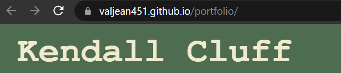

# Portfolio (HTML and CSS)

## Description

This page is intended to be a digital portfolio to introduce myself, and showcase key coding projects, to the end of communicating my level and breadth of skill to potential future employers. My main motivation in completing this project was to build an understanding of CSS, which I have had limited exposure to prior to this course, and try to replicate design choices that I have seen on other established webpages (such as fixing the nav to the viewport, and styling links). I learned a great deal, but the key learning was gaining an understanding of flexbox, and how to position elements very efficiently.

## Usage

The site is deployed! Navigate there using this link:
[https://valjean451.github.io/portfolio/](https://valjean451.github.io/portfolio/)

## Credits

Any images I used were open-source. I used many instructional resources to bridge the knowledge gaps:
[Flexbox Froggy](https://flexboxfroggy.com/)
[MDN Flexbox Tutorial](https://developer.mozilla.org/en-US/docs/Web/CSS/CSS_Flexible_Box_Layout/Basic_Concepts_of_Flexbox)
[ColorHunt](https://colorhunt.co/)
[Pixabay](https://pixabay.com/)

## License

Please refer to the license in the repository.
